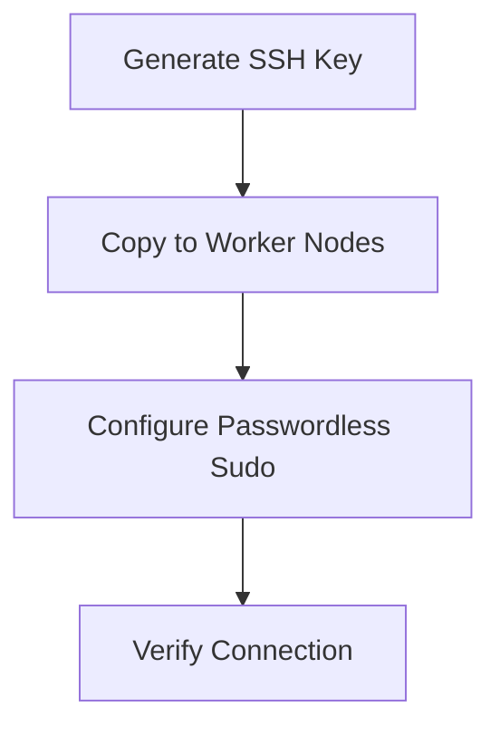
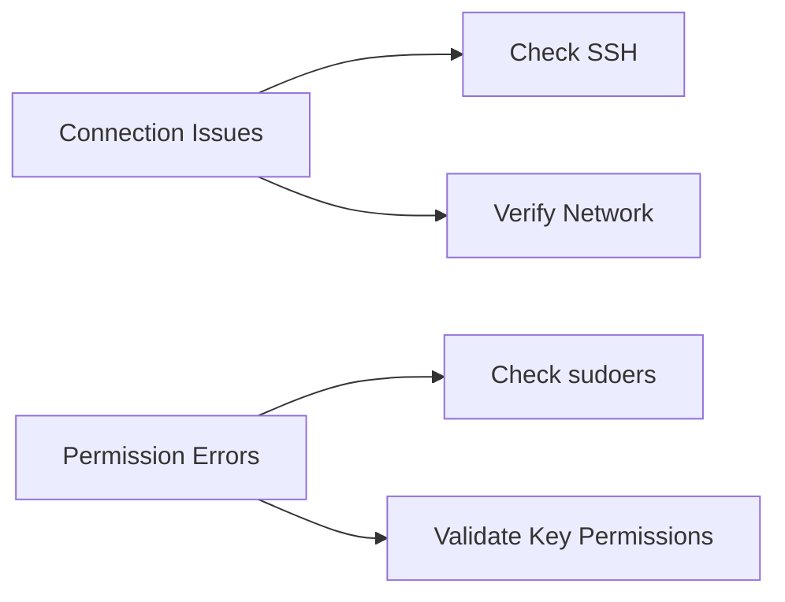

Here's your organized Ansible documentation with visual enhancements:

```markdown
#  Ansible Automation: From Zero to Production-Ready

```diff
+---------------------------------------------------------+
|  Network Configuration  |  SSH Setup  |  Ansible Config  |
+---------------------------------------------------------+
|  Playbook Examples      |  Testing    |  Troubleshooting |
+---------------------------------------------------------+
```

##  Network Configuration

```bash
#!/bin/bash
# Network Configuration Script
┌──────────────────────────────────────────────────────────┐
│ 1. Set static IP                                         │
│ 2. Configure DNS                                         │
│ 3. Update hosts file                                     │
└──────────────────────────────────────────────────────────┘
```

✅ **Expected Output:**
```text
2: ens33: <BROADCAST,MULTICAST,UP,LOWER_UP> mtu 1500 qdisc fq_codel state UP
    inet 192.168.2.160/24 brd 192.168.2.255 scope global noprefixroute ens33
```

##  SSH Key Setup



🔑 **Key Generation:**
```bash
ssh-keygen -t rsa -b 4096
```
```diff
+-----------------------------+
| Key Fingerprint:            |
| SHA256:PN0TKu8S6thhYsGmq... |
+-----------------------------+
```

##  Ansible Configuration

```ini
# ansible.cfg
[defaults]
inventory = /etc/ansible/servers.txt
host_key_checking = false

[privilege_escalation]
become = True
become_method = sudo
```

📂 **Inventory File Structure:**
```text
/etc/ansible/
├── ansible.cfg
└── servers.txt
```

##  Testing the Setup

```bash
ansible workers -m ping -vvv
```

✅ **Success Output:**
```json
{
    "ping": "pong",
    "invocation": {
        "module_args": {
            "data": "pong"
        }
    }
}
```

##  Example Playbook

```yaml
---
- hosts: workers
  tasks:
    - name: Ensure nginx is installed
      apt:
        name: nginx
        state: present
```

📊 **Execution Results:**
```diff
+------------------+-------+----------+----------+
| Host            | OK    | Changed  | Failed   |
+------------------+-------+----------+----------+
| ansible-worker01 | 2     | 1        | 0        |
+------------------+-------+----------+----------+
```

##  Troubleshooting



🔍 **Debug Commands:**
```bash
ansible -m ping -vvv              # Verbose output
ssh -v amer@ansible-worker01      # SSH debug
sudo cat /etc/sudoers.d/amer      # Verify sudo config
```

---

<center>

<br>
<b>Ansible Automation Platform</b>
</center>
```

